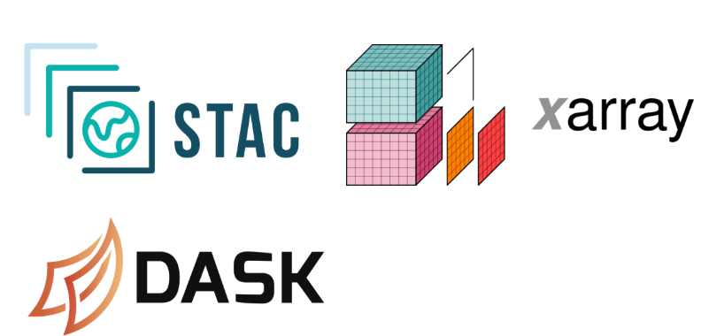

# Scalable Raster Analytics with STAC, xarray & Dask

Satellite imagery and raster datasets are growing at an unprecedented scale. Multi-year time series, high-resolution imagery, and global coverage products now routinely exceed what can fit into memory — or even onto a laptop. Traditional GIS workflows built around downloading individual GeoTIFF files and processing them one by one simply do not scale to modern Earth Observation demands.

Today’s geospatial challenges — climate monitoring, agricultural forecasting, disaster response, urban growth analysis — require workflows that are discoverable, streamable, parallelizable, and reproducible. We need systems that can query data dynamically, process only what is necessary, scale computation across cores, and produce cloud-ready outputs.

This guide addresses that shift. Instead of file-based raster processing, we adopt a cloud-native architecture built on open standards and scalable Python tools. By integrating STAC for discovery, Cloud-Optimized GeoTIFFs for efficient access, xarray for multi-dimensional data modeling, and Dask for parallel execution, we move from isolated raster files to scalable, analysis-ready data cubes.

---

## Core Concepts & Workflow Components

| Concept | Technology | Role in the workflow |
|--------|------------|----------------------|
| **Discovery** | STAC | Find and filter spatiotemporal raster assets across catalogs |
| **Streaming** | Cloud-Optimized GeoTIFF (COG) | Read only the bytes you need over HTTP |
| **Data cube** | xarray | Multi-dimensional raster model (time, band, y, x) |
| **Geospatial** | rioxarray | CRS, bounds, and raster I/O in xarray |
| **Scalability** | Dask | Parallel, chunked computation that fits memory |

## Prerequisites

- **Python**: 3.10+ recommended.
- **Experience**: Basic Python (functions, imports, data structures). Familiarity with NumPy or pandas is helpful but not required.
- **Environment**: Create a conda environment and install dependencies ([Environment Setup](setup.md)).

---

## License & attribution

This course uses open catalogs (e.g. Microsoft Planetary Computer) and open-source libraries. Please attribute data and software according to their respective licenses.
