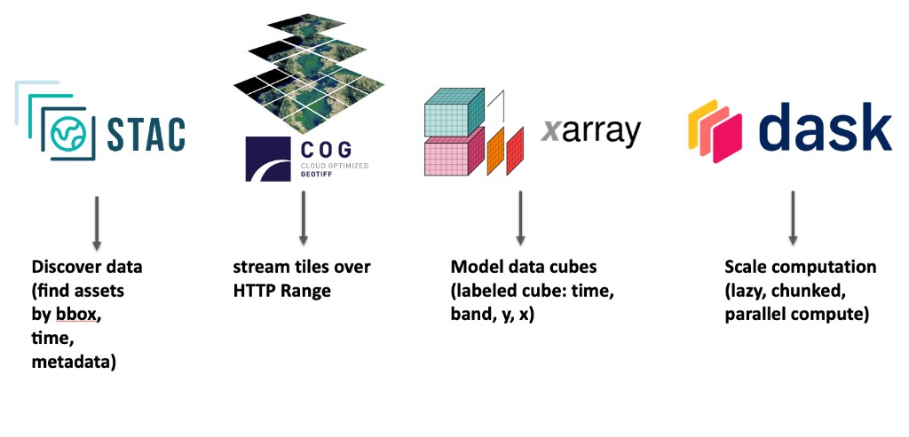

# Introduction

## Why cloud-native raster analytics?

Traditional raster workflows often assume:

- Data lives on a local disk or a mounted drive.
- Full scenes or tiles are downloaded before analysis.
- Processing is limited by RAM and single-machine CPU.

**Cloud-native** workflows invert this:

- **Discovery** happens via catalogs (STAC) over the web.
- **Data stays in the cloud**; only the required windows or bands are streamed (e.g. via COGs).
- **Compute** can be chunked and parallelized (Dask) so that large rasters never need to be fully loaded.

The same code can then run on a laptop or a cluster, including continental or global multi-temporal rasters.

---

## Workshop overview

This workshop covers a cloud-native raster pipeline in Python: **find data, stream it, model it as a cube, and scale the compute**.

| Topic | Tool | Lesson |
|-------|------|--------|
| Search satellite rasters by place, time, and metadata (e.g. cloud cover) | **STAC** | [1. STAC & COG](lessons/01-stac-cog.md) |
| Stream only the required tiles over HTTP — no full-scene download | **COG** | [1. STAC & COG](lessons/01-stac-cog.md) |
| Model rasters as a labeled cube (`time`, `band`, `y`, `x`) and select by name | **xarray** | [2. Data cube](lessons/02-xarray-datacube.md) |
| Attach CRS, clip, and reproject inside xarray | **rioxarray** | [3. rioxarray](lessons/03-rioxarray.md) |
| Run chunked, lazy, parallel analytics that fit in memory | **Dask** | [4. Dask](lessons/04-dask-analytics.md) |
| Assemble one vegetation-monitoring application from search to maps | all of the above | [5. Application](lessons/05-end-to-end.md) |

---

## Tooling overview

| Layer | Tool | Purpose |
|-------|------|--------|
| Discovery | **STAC** (pystac-client) | Search catalogs by bbox, time, and metadata |
| Storage / transfer | **Cloud-Optimized GeoTIFF** | HTTP range requests; read windows without full download |
| Data model | **xarray** | Labeled N-dimensional arrays (the “cube”) |
| Geospatial | **rioxarray** | CRS, bounds, and GeoTIFF/COG I/O in xarray |
| Compute | **Dask** | Lazy, chunked, parallel execution |

---
