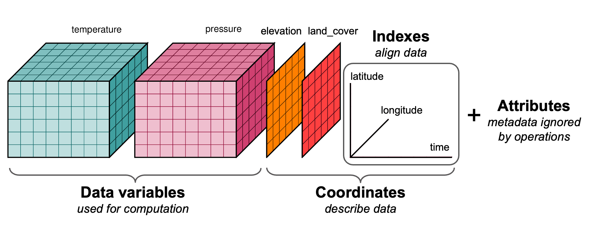

# xarray & the Data Cube

**Goal:** Model multi-dimensional rasters as **labeled** arrays with xarray: dimensions (e.g. time, band, y, x), coordinates, and attributes.

---

## The data cube concept

A **data cube** (or *raster data cube*) is a multi-dimensional array where dimensions typically include:

- **Spatial**: `y`, `x` (or lat/lon)
- **Temporal**: `time`
- **Thematic**: `band`, `variable`, or `layer`

Conceptually:

```
         time →
band  [  [ 2D raster ]  [ 2D raster ]  ...  ]
      [  [ 2D raster ]  [ 2D raster ]  ...  ]
      ...
```

In this course **xarray** represents this model: dimensions and coordinates are **labeled**, so selection is by name (e.g. `time`, `band`) instead of axis index. That makes code readable and less error-prone when combining multiple scenes or variables.

---

## From a STAC stack to a data cube

A single-band 2D raster is just a 2D array. Several Sentinel-2 scenes, each with red/NIR (and other) bands, form a **stack**. xarray holds that stack as:

- **Dimensions**: named axes (e.g. `time`, `band`, `y`, `x`).
- **Coordinates**: labels along each axis (dates, band names, projected x/y).
- **Data variables**: arrays that depend on those dimensions (`B04`, `B08`, `ndvi`).
- **Attributes**: metadata (CRS, units).

The lesson notebook builds this cube with `rioxarray.open_rasterio` + `xr.concat(..., dim="time")` over northern Karnataka — not with hand-made NumPy arrays.



*Source: Stephan Hoyer, ECMWF presentation.*  
[Link to original talk](https://docs.google.com/presentation/d/16CMY3g_OYr6fQplUZIDqVtG-SKZqsG8Ckwoj2oOqepU/edit#slide=id.g2b68f9254d_1_27)

---

## Core structures

### DataArray and Dataset

A **DataArray** is one labeled array (e.g. `stack["B04"]`). A **Dataset** is several DataArrays that share dimensions (B02, B03, B04, B08, then `ndvi`).

```python
stack = xr.concat(scenes, dim="time")          # Dataset: time, y, x
cube = stack.to_array(dim="band")              # DataArray: band, time, y, x
red = stack["B04"].isel(time=0)
stack["ndvi"] = (stack["B08"] - stack["B04"]) / (stack["B08"] + stack["B04"])
```

---

## Why labels matter

With **NumPy**, indexing is `arr[i, j]` or `arr[0:10, :]` and the meaning of each axis must be remembered. With **xarray**:

```python
stack.isel(time=0)
stack["B04"].sel(time=t0)
stack.isel(time=slice(0, 3))
ts = stack["ndvi"].mean(dim=["y", "x"])
```

That makes code **readable** and **less error-prone** when combining multiple scenes or variables.

---

## Dimensions typical in raster cubes

| Dimension | Meaning | Example coordinates |
|-----------|--------|----------------------|
| `x` | Horizontal (easting / lon) | Projected x or longitude |
| `y` | Vertical (northing / lat) | Projected y or latitude |
| `band` | Spectral/thematic layer | `["red", "green", "blue", "nir"]` |
| `time` | Time step | `datetime64` dates |

So a multi-temporal, multi-band stack might have shape `(time, band, y, x)`.

---

## Lazy vs eager

xarray can wrap **Dask** arrays instead of NumPy. Then the array is **lazy**: operations build a task graph; actual reads and compute happen on `.compute()` or when plotting is triggered. This is used in Lesson 4 for scalable analytics; in Lesson 3 COGs are opened as xarray (with rioxarray) and can be lazy by default.

---

## Summary

| Concept | Detail |
|--------|--------|
| Data cube | Multi-dimensional raster with labeled dimensions (time, band, y, x) |
| DataArray | Single array + dims + coords + attrs |
| Dataset | Multiple DataArrays sharing dimensions |
| Selection | `.sel()` by coordinate, `.isel()` by index, `.slice()` |
| Lazy | xarray can hold Dask arrays; compute on demand |

In next lesson we use **rioxarray** to open COGs as xarray objects with CRS and spatial coordinates.

---

Download the notebook for this lesson: `notebooks/02-xarray-datacube.ipynb`.
